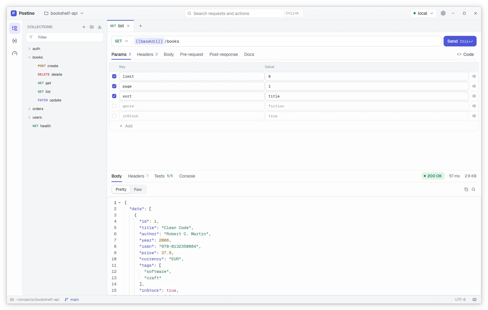
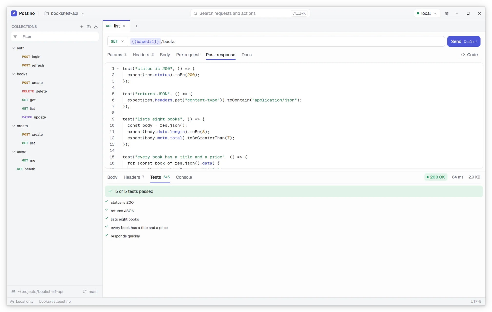
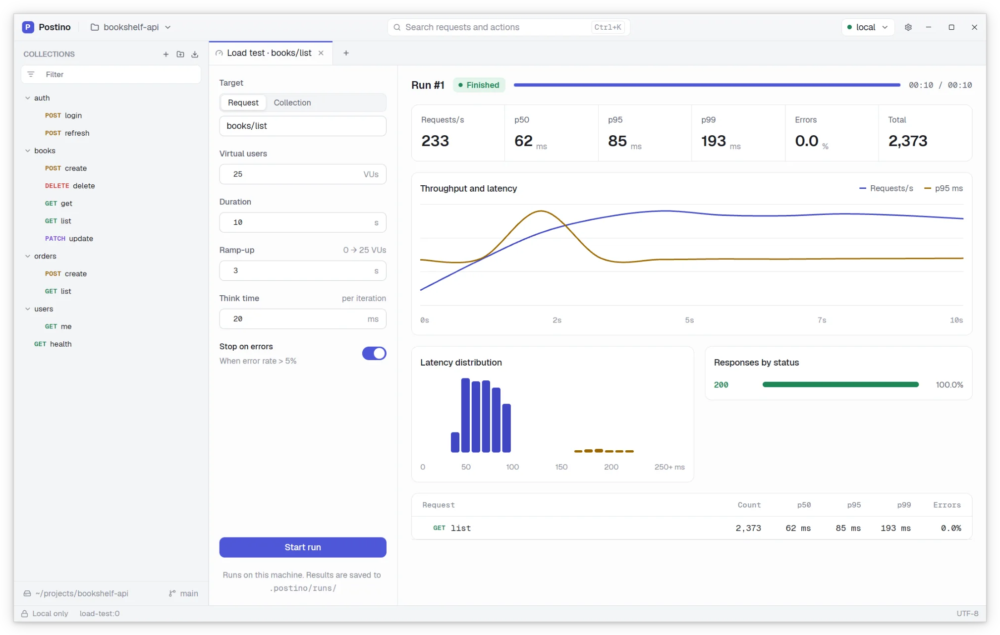

# Postino

A lightweight, native, open source HTTP client, without accounts and without cloud storage. Your
requests live as plain files on your disk, and you decide where they go: git, a shared folder,
or nowhere else.

[Website](https://postino.tanis.codes) · [Download](https://postino.tanis.codes/install.html) ·
[Documentation](#documentation)

<picture>
  <source media="(prefers-color-scheme: dark)" srcset="site/img/hero-dark.webp">
  
</picture>

> Status: verified on Linux. Windows and macOS builds have not been verified yet.

## Goals

- Cross-platform desktop app: Linux, Windows and macOS.
- Written in Rust, with the UI built on [`gpui`](https://crates.io/crates/gpui), the GPU-accelerated
  framework behind the Zed editor.
- A familiar layout: collections, requests, environments and a response viewer.
- **No login, no telemetry, no online sync.** Nothing leaves your machine except the requests you
  send, and an optional update check on macOS and Windows that sends no identifiers.
- Requests are stored locally as human readable text files, designed to produce clean diffs in git.
- Fully open source.

Scripts and tests in JavaScript, before and after each request:

<picture>
  <source media="(prefers-color-scheme: dark)" srcset="site/img/scripts-dark.webp">
  
</picture>

Load testing built in, with live throughput and latency:

<picture>
  <source media="(prefers-color-scheme: dark)" srcset="site/img/loadtest-dark.webp">
  
</picture>

## Building from source

Install Rust with [`rustup`](https://rustup.rs). The toolchain version is pinned in
`rust-toolchain.toml` and installed on the first build. Then install the system dependencies for
your platform:

- **Linux** (Debian and Ubuntu package names):

  ```
  sudo apt install build-essential pkg-config cmake libfontconfig-dev libfreetype-dev \
      libwayland-dev wayland-protocols libxkbcommon-dev libxkbcommon-x11-dev \
      libx11-xcb-dev libxcb1-dev libvulkan-dev
  ```

- **macOS**: Xcode, with its command line tools.
- **Windows**: the Visual Studio Build Tools with the "Desktop development with C++" workload.

Build and run:

```
git clone https://github.com/tanisperez/postino.git
cd postino
cargo run -- examples/sample-workspace   # debug build, opens the sample workspace
cargo build --release                    # optimized binary in target/release/postino
cargo test --all-targets                 # run the tests
```

On Linux and macOS the `Makefile` wraps the usual commands (`make run`, `make release`,
`make test`, `make lint`, ...). Run `make help` for the full list.

## Documentation

- [`.postino` file format](docs/format.md): how requests, collections and environments are stored.
- [Scripting](docs/scripting.md): pre-request and post-response scripts, tests and template
  functions.
- [Releasing](docs/releasing.md): how versions are built and published.

## License

Copyright 2026 Estanislao Pérez Nartallo.

Postino is licensed under the [Apache License 2.0](LICENSE). See [NOTICE](NOTICE).
